+++
Title = "Building a metrics API on AWS EC2 with FastAPI, k3s (Kubernetes), Terraform, Ansible, and CI/CD with GitHub Actions"
summary = "FastAPI-based API running in a k3s cluster inside an AWS EC2 instance, exposing performance metrics for the machine and the application, provisioned with Terraform, configured with Ansible, and updated via GitHub Actions."
date = 2025-11-15
toc = true
readTime = true
autonumber = true
tags = ["cloud", "devops", "system-design", "aws", "ec2", "kubernetes", "k3s", "fastapi", "terraform", "ansible", "github actions", "ci/cd"]
+++

## Purpose of this project

Seeking to deepen my knowledge in cloud architecture and the different ways of building cloud environments, I decided to build an API from scratch and provision it on a Linux EC2 instance to test some of the concepts I have been learning over the last few days, mainly during my studies for the AWS Cloud Architect certification.

Objectively, I developed a Python (FastAPI) API that collects metrics from the instance and from the application running on it, and deployed it to run in a Kubernetes cluster on an EC2 instance in AWS. The entire infrastructure is provisioned with Terraform, the server and cluster configuration is done with Ansible, and the deployment is automated with GitHub Actions. The project was designed to be integrated later with Prometheus and Grafana for full observability.

### Goals of this project

- Build a simple API that will expose performance metrics for both the instance and the application itself, in Python (served by the FastAPI web framework);
- Run it in a Kubernetes cluster inside a Linux AWS EC2 instance;
- Provision it using Terraform (VPC, subnet, EC2, Security Groups, IAM);
- Configure it with Ansible (installs Docker, K3s, dependencies, performs deploy);
- Keep it updated via CI/CD with GitHub Actions (image build and pull from DockerHub, push, automatic deploy).

### Project architecture diagram

")

---

## API with FastAPI

The role of this API is to expose performance metrics both from the host where the pod is running and from the application itself, that is, the API itself, a backend software written in Python, packaged in Docker, and running inside a Kubernetes cluster — whose purpose is to collect and expose operational metrics from both the environment where it is running and its own internal state.

This is a fundamental layer to enable future integration with observability tools such as Prometheus and Grafana. For this, I chose the [FastAPI](https://fastapi.tiangolo.com/) framework, which provides fast routes, excellent asynchronous performance and an internal automatic documentation model. This choice enables efficient communication between the distributed components of the cluster while keeping the implementation of endpoints simple.

The API design serves the following *endpoints*:
* `GET /health`: used by Kubernetes for Liveness and Readiness probes.
    * Example:
    ```json
    {
        "status": "ok",
        "app": "k8s-cluster-performance-stack",
        "version": "1.0.0"
    }
    ```
* `GET /info`: provides information about the application running on the instance.
    * Example:
    ```json
    {
        "app_name": "k8s-cluster-performance-stack",
        "version": "1.0.0",
        "environment": "dev",
        "server_time": "2025-11-15T15:30:00Z"
    }
    ```
* `GET /metrics/system`: metrics from the host where the *pod* is running.
    * Example:
    ```json
    {
        "cpu": {
            "percent": 21.3,
            "cores": 2
        },
        "memory": {
            "total_mb": 993,
            "used_mb": 450,
            "percent": 45.3
        },
        "disk": {
            "total_gb": 20.0,
            "used_gb": 8.4,
            "percent": 42.0
        },
        "load_average": {
            "1m": 0.42,
            "5m": 0.36,
            "15m": 0.30
        }
    }
    ```
* `GET /metrics/app`: metrics from the application itself (at “application” level).
    * Example:
    ```json
    {
        "uptime_seconds": 1234,
        "requests_count": 87,
        "startup_time": "2025-11-15T15:00:00Z"
    }
    ```

The following dependencies are used as requirements for the API to run, located in a `.txt` file in the root of the project repository:
```
fastapi==0.121.3
uvicorn[standard]==0.38.0
psutil==7.1.3
python-dotenv==1.2.1
```

To test locally, I used [Uvicorn](https://uvicorn.dev/), a server implementation based on the [ASGI](https://en.wikipedia.org/wiki/Asynchronous_Server_Gateway_Interface) protocol, in order to use the `/docs` section of FastAPI:
```
uvicorn app.main:app --reload
````

The repository with the API code can be accessed [here](https://github.com/CassivsGabriellis/metrics-api-k8s-cluster-performance/tree/main/app).

---

## Containerizing the API with Docker

Next comes the containerization of the API, since the rest of the architecture depends on a consistent, standardized, and easily replicable image. For this, I created a minimalist **Dockerfile**, based on a “slim” Python 3.12 image, ensuring that the environment would be lightweight, fast to build and suitable for running on machines with limited resources, such as a t3.small EC2 instance used in the AWS Free Tier.

Inside the Dockerfile, I define essential best practices such as configuring the environment variables `PYTHONDONTWRITEBYTECODE` and `PYTHONUNBUFFERED`, which reduce disk write overhead and improve log observability. Next, I install the build dependencies needed for packages like `psutil`, include the `requirements.txt` to install the Python dependencies and copy the code from the `app/` folder into the image. Finally, I configure the container to expose port 8000 and run the Uvicorn server, allowing the FastAPI API to respond to HTTP requests inside the Kubernetes cluster.

### Docker file at the project root
```docker
# =========================
# 1) Builder: installs deps
# =========================
FROM python:3.12-slim AS builder

# Better logging and no .pyc
ENV PYTHONDONTWRITEBYTECODE=1 \
    PYTHONUNBUFFERED=1

WORKDIR /app

# Build dependencies (psutil, etc.)
RUN apt-get update && \
    apt-get install -y --no-install-recommends \
        build-essential \
    && rm -rf /var/lib/apt/lists/*

# Install Python dependencies in a venv
COPY requirements.txt .
RUN python -m venv /opt/venv \
    && /opt/venv/bin/pip install --upgrade pip \
    && /opt/venv/bin/pip install --no-cache-dir -r requirements.txt

# =========================
# 2) Runtime: final image
# =========================
FROM python:3.12-slim AS runtime

ENV PYTHONDONTWRITEBYTECODE=1 \
    PYTHONUNBUFFERED=1

WORKDIR /app

# Copy the already-prepared virtual environment
COPY --from=builder /opt/venv /opt/venv
ENV PATH="/opt/venv/bin:$PATH"

# Copy only the application code
COPY app ./app

# API port
EXPOSE 8000

# Default variables
ENV APP_ENV=prod

# Command to run the FastAPI API
CMD ["uvicorn", "app.main:app", "--host", "0.0.0.0", "--port", "8000"]
````

### Manual image build and push (for testing)

```bash
# Build the image
docker build -t cassiano00/metrics-api:latest .

# Test locally
docker run --rm -p 8000:8000 cassiano00/metrics-api:latest

# Push to Docker Hub (for Kubernetes to pull)
docker push cassiano00/metrics-api:latest
```

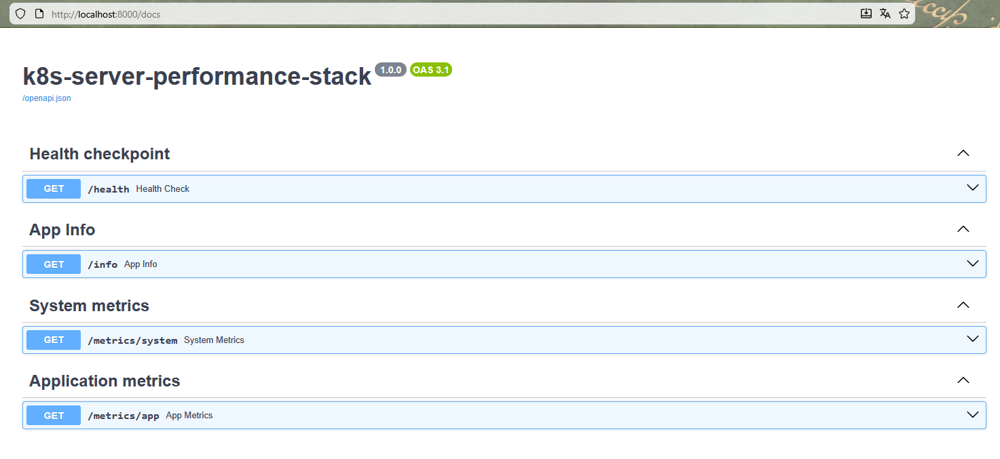

---

## Orchestration in a Kubernetes cluster

With the image built, I orchestrate a Kubernetes cluster through YAML manifests. The first component created was `namespace.yaml`, a fundamental practice that logically organizes resources and avoids conflicts between different services within the cluster. Creating the **metrics-api** namespace ensures isolation and makes future management and automation operations easier.

To test locally, I use [Minikube](https://minikube.sigs.k8s.io), which implements a local Kubernetes cluster.

```yaml
apiVersion: v1
kind: Namespace
metadata:
  name: metrics-api
  labels:
    name: metrics-api
```

Applying the settings present in the `k8s/namespace.yaml` file:

```bash
kubectl apply -f k8s/namespace.yaml
```

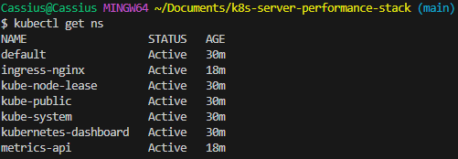

Next, I define `deployment.yaml`, a core Kubernetes resource responsible for managing and keeping the application running in a declarative way. In the Deployment, I configure 1 (one) replica, since this is a test environment. I specify the Docker image built earlier and add liveness and readiness probes pointing to the `/health` endpoint. These probes are essential for Kubernetes to automatically detect container failures and ensure that only healthy instances receive traffic. In addition, I configure CPU and memory *requests* and *limits*, preventing the container from consuming more resources than it should — which is critical in small environments such as a low-cost EC2.

```yaml
apiVersion: apps/v1
kind: Deployment
metadata:
  name: metrics-api-deployment
  namespace: metrics-api
  labels:
    app: metrics-api
spec:
  replicas: 1
  selector:
    matchLabels:
      app: metrics-api
  template:
    metadata:
      labels:
        app: metrics-api
    spec:
      containers:
        - name: metrics-api
          image: cassiano00/metrics-api:latest
          imagePullPolicy: IfNotPresent
          ports:
            - containerPort: 8000
          env:
            - name: APP_ENV
              value: "prod"
          resources:
            requests:
              cpu: "100m"
              memory: "128Mi"
            limits:
              cpu: "500m"
              memory: "256Mi"
          readinessProbe:
            httpGet:
              path: /health
              port: 8000
            initialDelaySeconds: 5
            periodSeconds: 10
            timeoutSeconds: 2
            failureThreshold: 3
          livenessProbe:
            httpGet:
              path: /health
              port: 8000
            initialDelaySeconds: 10
            periodSeconds: 20
            timeoutSeconds: 2
            failureThreshold: 3
```

Running the configuration:

```bash
kubectl apply -f k8s/deployment.yaml
```

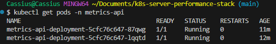

With the Deployment defined, I create a `service.yaml` of type **ClusterIP** to provide a stable internal endpoint that abstracts the pods. The Service exposes port `80` internally and forwards calls to port `8000` on the container, standardizing access and allowing other components, such as [Ingress](https://kubernetes.io/docs/concepts/services-networking/ingress/), to interact with the backend without depending on the internal structure of the Deployment. This is a good isolation practice in clusters.

```yaml
apiVersion: v1
kind: Service
metadata:
  name: metrics-api-service
  namespace: metrics-api
  labels:
    app: metrics-api
spec:
  selector:
    app: metrics-api
  ports:
    - name: http
      port: 80
      targetPort: 8000
  type: ClusterIP
```

Applying the configuration:

```bash
kubectl apply -f k8s/service.yaml
```

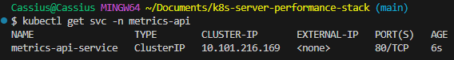

To finalize the Kubernetes layer, I implement the `ingress.yaml` file, responsible for providing an external HTTP interface to the cluster through the NGINX Ingress Controller. In the local environment, where Minikube is running with the Docker driver on Windows, direct access to the internal cluster IP is not possible. For this reason, I use **`minikube tunnel`**, which creates a route between the host and the Ingress Controller, reliably exposing incoming traffic on `127.0.0.1`.

With this configuration, Ingress acts as the official entry point of the application inside the cluster, mapping external requests to the internal Service (`metrics-api-service:80`). This removes the need for temporary tunnels such as `minikube service ... --url` and ensures a traffic flow identical to what is used in real environments: client → NGINX Ingress → Service → Pods.

By centralizing external access on Ingress, the architecture becomes more organized, scalable, and aligned with the pattern used in production Kubernetes clusters. This component also enables future extensions — such as TLS support, authentication, rate limiting, and advanced routing. In addition, it naturally prepares the environment for future integration with Prometheus and Grafana, facilitating the exposure of metrics, dashboards, and full observability of the application.

```yaml
apiVersion: networking.k8s.io/v1
kind: Ingress
metadata:
  name: metrics-api-ingress
  namespace: metrics-api
  annotations:
    kubernetes.io/ingress.class: "nginx"
spec:
  rules:
    - http:
        paths:
          - path: /
            pathType: Prefix
            backend:
              service:
                name: metrics-api-service
                port:
                  number: 80
```

Running the configuration:

```bash
kubectl apply -f k8s/ingress.yaml
```

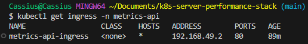

Testing the endpoint via `curl`:

```bash
curl http://127.0.0.1/health
curl http://127.0.0.1/metrics/system
```

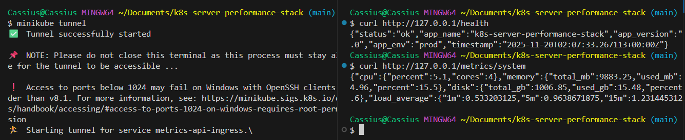

---

## Provisioning the infrastructure with Terraform

Moving on to the infrastructure stage of the project, my priority was to establish a solid and reproducible foundation to run the Kubernetes cluster that will later host the metrics API. To do this, I started by provisioning the network and compute layers using Terraform. The goal was to ensure that the entire application foundation — from the VPC to the EC2 instance — was created in a declarative, auditable and consistent way. I created a dedicated VPC, a public subnet and a route table connected to an Internet Gateway, ensuring that the instance had internet access to install dependencies, pull images and run k3s without restrictions. Then I configured a Security Group with strictly necessary rules: SSH access for administration and open HTTP/HTTPS ports for the future Ingress Controller. With that in place, I defined a **t3.small** EC2 instance — enough for a validation environment — using the Ubuntu 22.04 AMI, ensuring compatibility with Docker, k3s and the rest of the stack tools.

The following items will be provisioned in the cloud:

* 1 VPC
* 1 public subnet
* Internet gateway + route table
* 1 ElasticIP (fixed public IP)
* 1 Security Group (SSH + HTTP/HTTPS)
* 1 EC2 instance (t3.small) that will serve as a [k3s](https://docs.k3s.io/) node

### Configuring the VPC

I started by creating a dedicated VPC with a large CIDR block (`10.0.0.0/16`), allowing flexibility for future expansion of subnets, load balancers or additional nodes. Then I configured a public subnet (`10.0.1.0/24`) with `map_public_ip_on_launch` enabled, ensuring that instances inside this subnet would automatically receive a public IP, eliminating the need for Elastic IPs in the validation environment. I associated this subnet with a route table containing the default route (`0.0.0.0/0`) pointing to a newly created Internet Gateway, ensuring full external connectivity — something essential so that the node can download packages, pull Docker images and communicate with public registries. I also provisioned a static IPv4 address via an ElasticIP associated with the instance.

**`main.tf`**:

```
# VPC
resource "aws_vpc" "this" {
  cidr_block = "10.0.0.0/16"
    tags = {
        Name = "${var.project_name}-vpc"
    }
  enable_dns_hostnames = true
  enable_dns_support = true
}

# Public Subnet
resource "aws_subnet" "public" {
  vpc_id                    = aws_vpc.this.id
  cidr_block                = "10.0.1.0/24"
  map_public_ip_on_launch   = true

  tags = {
    Name = "${var.project_name}-public-subnet"
  }
}

# Public Route Table for subnet
resource "aws_route_table" "public" {
  vpc_id = aws_vpc.this.id

  route {
    cidr_block = "0.0.0.0/0"
    gateway_id = aws_internet_gateway.this.id
  }
    tags = {
        Name = "${var.project_name}-public-rt"
    }
}

...

# Elastic IP associated with the k3s_node instance
resource "aws_eip" "k3s_eip" {
  domain   = "vpc"
  instance = aws_instance.k3s_node.id

  tags = {
    Name = "${var.project_name}-eip"
  }
}
```

### Configuring a Security Group

On the security side, I built a Security Group following the principle of least privilege, allowing only the required traffic: port 22 for SSH (limited via a parameterized variable), port 80 to receive HTTP traffic in the future via Ingress, and port 443 to anticipate TLS scenarios. All other traffic remains blocked.

**`main.tf`**:

```
# Security Group for EC2 instance
resource "aws_security_group" "ec2_sg" {
  name        = "${var.project_name}-ec2-sg"
  description = "Security group for metrics API k3s node"
  vpc_id      = aws_vpc.this.id

  # SSH access
  ingress {
    description      = "Allow SSH"
    from_port        = 22
    to_port          = 22
    protocol         = "tcp"
    cidr_blocks      = [var.allowed_ssh_cidr]
  }
  
  # HTTP access
  ingress {
    description      = "Allow HTTP"
    from_port        = 80
    to_port          = 80
    protocol         = "tcp"
    cidr_blocks      = ["0.0.0.0/0"]
  }

  # HTTPS (for future TLS)
  ingress {
    from_port   = 443
    to_port     = 443
    protocol    = "tcp"
    cidr_blocks = ["0.0.0.0/0"]
  }

  # Egress: allow everything
  egress {
    from_port   = 0
    to_port     = 0
    protocol    = "-1"
    cidr_blocks = ["0.0.0.0/0"]
  }

  tags = {
    Name = "${var.project_name}-ec2-sg"
  }
}
```

### Configuring the EC2 instance

With the network set up, I completed the provisioning by creating a `t3.small` EC2 instance, sufficient for test scenarios, using the official Ubuntu 22.04 AMI. This choice was deliberate, given its optimizations, full compatibility with Docker, and native support for **systemd** — essential for the proper operation of k3s services. In this way, the entire foundational layer of the cluster was defined not only declaratively, but also tuned to run containerized workloads.

**`main.tf`**:

```
# Ubuntu AMI
data "aws_ami" "ubuntu" {
  most_recent = true
  owners      = ["099720109477"] # Canonical

  filter {
    name   = "name"
    values = ["ubuntu/images/hvm-ssd/ubuntu-jammy-22.04-amd64-server-*"]
  }

  filter {
    name   = "virtualization-type"
    values = ["hvm"]
  }
}

# EC2 instance that will run k3s
resource "aws_instance" "k3s_node" {
  ami                         = data.aws_ami.ubuntu.id
  instance_type               = "t3.small"
  subnet_id                   = aws_subnet.public.id
  vpc_security_group_ids      = [aws_security_group.ec2_sg.id]
  key_name                    = var.key_name
  associate_public_ip_address = false 

  tags = {
    Name = "${var.project_name}-k3s-node"
  }
}
```

Before this process, I had already set up my environment with the [AWS CLI](https://docs.aws.amazon.com/cli/latest/userguide/cli-chap-getting-started.html), so that the appropriate permissions for connecting to my AWS profile were established.

I also had to create a **key pair** in the `sa-east-1` region so that Terraform could apply the configuration to create the EC2 instance, which is referenced as `key_name = var.key_name`.

Then, by initializing the Terraform environment in the `/infra/terraform` directory and applying the defined configuration:

```bash
terraform init
terraform apply
```

The environment was successfully provisioned in AWS:

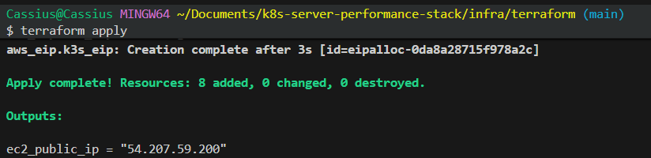
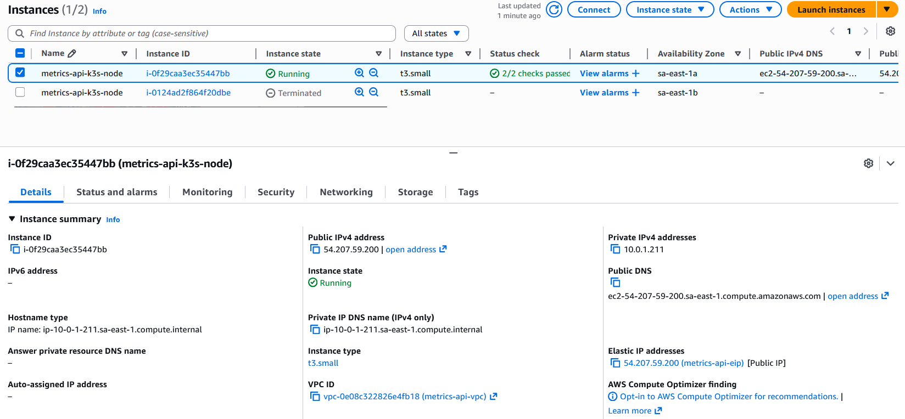

The rest of the Terraform configuration-as-code can be accessed [here](https://github.com/CassivsGabriellis/metrics-api-k8s-cluster-performance/tree/main/infra/terraform).

---

## Applying configuration with Ansible

With the infrastructure provisioned, I moved on to the step of automating the configuration of the Kubernetes node using Ansible. My goal was to transform a freshly created instance into a functional Kubernetes node, ready to receive workloads, without any manual configuration. I structured a playbook that runs from package updates and installation of base dependencies, through the full configuration of the container runtime and the k3s distribution itself. I installed Docker to ensure support for containerd-based workloads and compatibility with development tools, and then ran the official k3s installation script with specific options — including disabling Traefik, keeping the cluster clean for later deployments.

**`playbook.yaml`**:

```
---
- name: Configure EC2 as k3s Kubernetes node
  hosts: k3s_node
  become: true
  vars:
    k3s_version: "" 
  tasks:
    - name: Update apt cache
      apt:
        update_cache: yes
        cache_valid_time: 3600

    - name: Install base packages
      apt:
        name:
          - curl
          - wget
          - git
        state: present

    - name: Install Docker
      apt:
        name:
          - docker.io
        state: present

    - name: Enable and start Docker
      systemd:
        name: docker
        state: started
        enabled: true

    - name: Add ubuntu user to docker group
      user:
        name: ubuntu
        groups: docker
        append: yes

    - name: Download and install k3s
      shell: |
        curl -sfL https://get.k3s.io | INSTALL_K3S_EXEC="server --disable traefik" sh -
      args:
        creates: /usr/local/bin/k3s

    - name: Install NGINX Ingress Controller
      become: false
      command: >
        kubectl apply -f https://raw.githubusercontent.com/kubernetes/ingress-nginx/controller-v1.14.0/deploy/static/provider/cloud/deploy.yaml

    - name: Wait for k3s service to be active
      systemd:
        name: k3s
        state: started
        enabled: true

    - name: Ensure .kube directory exists for ubuntu user
      file:
        path: /home/ubuntu/.kube
        state: directory
        owner: ubuntu
        group: ubuntu
        mode: "0700"

    - name: Copy k3s kubeconfig to ubuntu user
      copy:
        src: /etc/rancher/k3s/k3s.yaml
        dest: /home/ubuntu/.kube/config
        owner: ubuntu
        group: ubuntu
        mode: "0600"
        remote_src: yes
    
    - name: Export KUBECONFIG in ubuntu .bashrc
      lineinfile:
        path: /home/ubuntu/.bashrc
        regexp: '^export KUBECONFIG='
        line: 'export KUBECONFIG=$HOME/.kube/config'
        create: yes
        owner: ubuntu
        group: ubuntu
        mode: "0644"

    - name: Create kubectl symlink for convenience
      file:
        src: /usr/local/bin/kubectl
        dest: /usr/local/bin/k3s-kubectl
        state: link
      ignore_errors: yes

    - name: Ensure kubectl installed (k3s includes it)
      file:
        src: /usr/local/bin/k3s
        dest: /usr/local/bin/kubectl
        state: link
      ignore_errors: yes
```

Along with my host specifications in the local **`host_vars/k3s-ec2-node.yaml`** file:

```
ansible_host: <instance-public-ip>
ansible_user: ubuntu
ansible_ssh_private_key_file: <metrics-api-key.pem-local-address>
```

**`inventory.ini`**:

```
[k3s_node]
k3s-ec2-node
```

With these settings in place, I run the command for Ansible to apply them:

```
ansible-playbook -i inventory.ini playbook.yaml
```

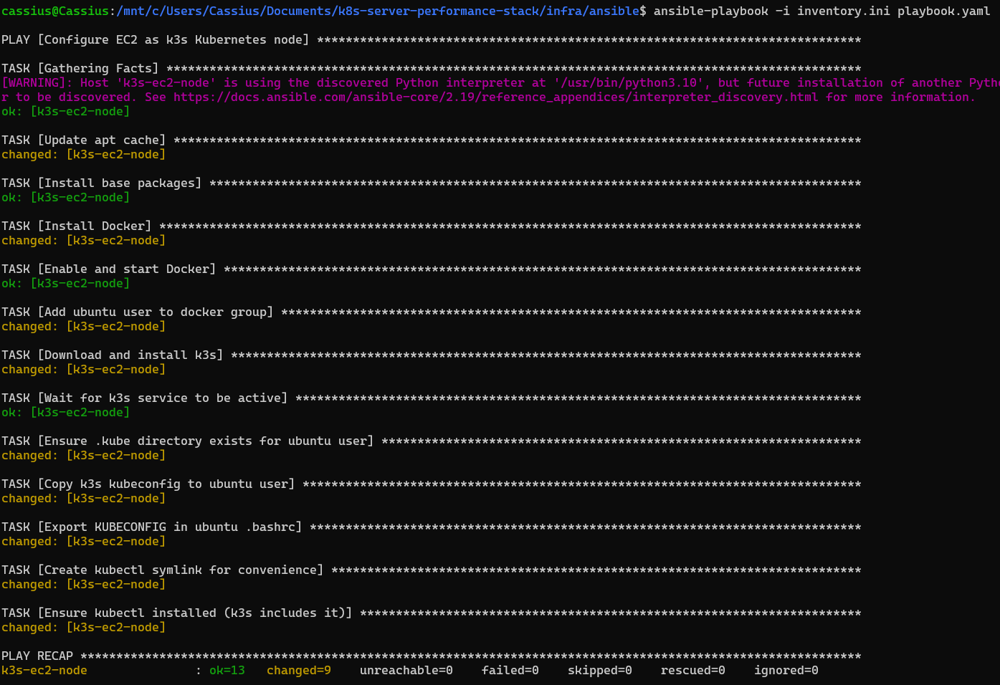

After installing k3s via Ansible, I kept the default kubeconfig generated by the service at `/etc/rancher/k3s/k3s.yaml`, without modifying the `127.0.0.1:6443` endpoint, since cluster administration will be done directly on the EC2 instance itself using `kubectl`. During automation, the playbook handled installing Docker, starting k3s as a service, configuring the binaries and symlinks needed to use the kubectl client, ensuring that all the essential utilities were available to the machine’s default user. At the end of this step, the EC2 instance was already operating as a functional Kubernetes node, initialized and ready to receive applications and deployments automated via the CI/CD pipeline.

To check the current state of the instance, I accessed it via SSH to verify the node running inside it:
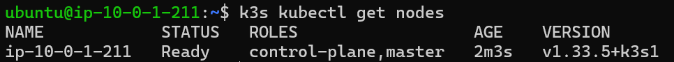

---

## CI/CD pipeline with GitHub Actions

With the infrastructure provisioned and the k3s cluster operational on EC2, it is time to design a fully automated CI/CD pipeline using GitHub Actions. The goal is to eliminate any need for manual intervention in both build and deploy, ensuring that every change to the API code results in a new version of the service running in the cluster in an immediate, predictable, and reliable way.

### Cluster bootstrap on the EC2 instance

Before continuing with the creation of the CI/CD flow, it is important to note that the instance is currently without Kubernetes objects on EC2. If you run `kubectl get ns` and `kubectl get all -n metrics-api`, the result will be that `metrics-api` does not appear in the list of **namespaces** (a way of organizing and isolating resources within a cluster) and nothing exists in `-n metrics-api` (because the namespace does not exist).

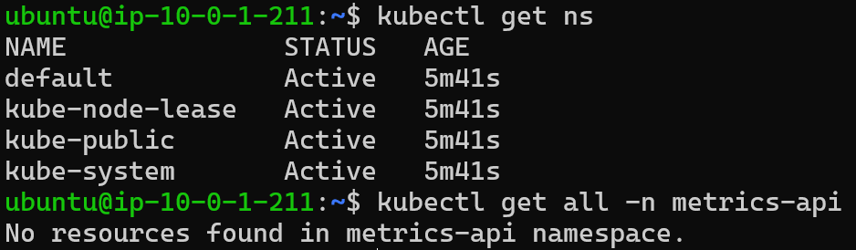

Therefore, it is necessary to:

* Create the `metrics-api` namespace;
* Create the `metrics-api-deployment` Deployment, the Service, and the Ingress.

To do this, I perform a manual bootstrap on EC2, that is, I manually initialize and configure the instance.

1. I copied the Kubernetes *manifests* from the `/k8s` folder into EC2 (from WSL):

   ```bash
   scp -i ~/.ssh/metrics-api-key.pem -r k8s ubuntu@<public-ip-instance>:/home/ubuntu/k8s
   ```

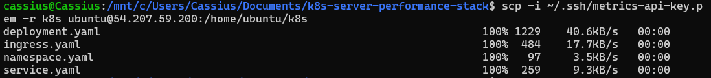

2. After that, I accessed the EC2 instance to check if the folder was present:

   ```bash
   ssh -i ~/.ssh/metrics-api-key.pem ubuntu@<public-ip-instance>
   ```

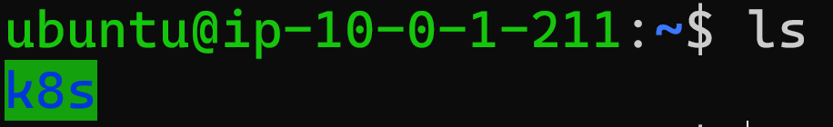

3. I applied the *manifests* inside the instance:

   ```bash
   kubectl apply -f /home/ubuntu/k8s/namespace.yaml
   kubectl apply -f /home/ubuntu/k8s/deployment.yaml
   kubectl apply -f /home/ubuntu/k8s/service.yaml
   kubectl apply -f /home/ubuntu/k8s/ingress.yaml
   ```

4. And I checked that the *manifests* inside the instance were running:

   ```bash
   kubectl get ns
   kubectl get deploy -n metrics-api
   kubectl get pods -n metrics-api
   kubectl get svc -n metrics-api
   ```

In this way:

* The `metrics-api` namespace will exist
* The `metrics-api-deployment` will exist
* The Service and Ingress will exist

Thus, on the next execution of GitHub Actions, the command:

```sh
kubectl -n metrics-api set image deployment/metrics-api-deployment \
  metrics-api=${IMAGE}
```

will work, since the deployment specifications already exist and only need the Docker image.

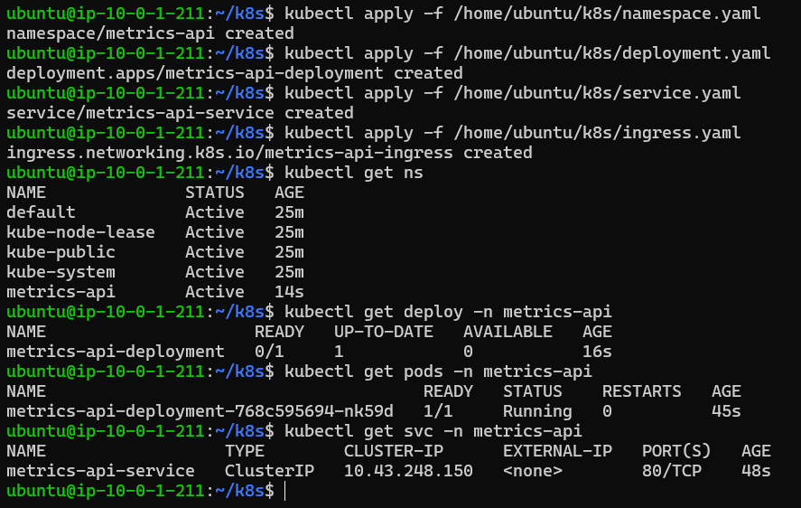

The following Repository `secrets` were set to be used in the `ci-cd.yaml` file:
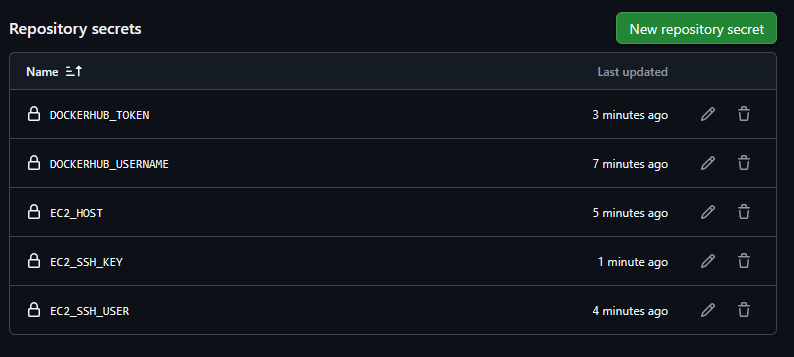

* `DOCKERHUB_USERNAME` - Docker Hub username
* `DOCKERHUB_TOKEN` - Docker Hub access token/password
* `EC2_HOST` - public IP of the instance (the `ec2_public_ip` value generated by Terraform)
* `EC2_SSH_USER` - I chose `ubuntu` for Ubuntu AMIs
* `EC2_SSH_KEY` - content of the private key for SSH (`.pem` file)

This initial process creates the base structure of the cluster — including the `metrics-api` namespace and the essential resources — allowing the automated pipeline to work on top of an existing foundation. Once these initial objects are applied to the cluster, all subsequent updates can be controlled exclusively by CI/CD, without the need to re-apply manifests.

With this foundation in place, I built the GitHub Actions pipeline divided into two phases:

1. **Build and Push of the Docker image:**
   The workflow starts by checking out the repository and setting up Docker Buildx. It then builds the API image and pushes it to Docker Hub using two tags: `latest`, intended for continuous development environments, and an immutable tag based on the commit SHA, ensuring traceability and reliable versioning. This approach guarantees that every build is reproducible and tied to a specific point in the code’s evolution.

2. **Automatic deploy to the k3s cluster:**
   In the second stage, the pipeline establishes an SSH connection to the EC2 instance and uses `kubectl set image` to update the existing Deployment with the newly published image. Since the cluster already has all manifests applied from the initial bootstrap, the pipeline only needs to adjust the Deployment’s image, making the process fast, efficient, and free of resource duplication. After the update, the workflow waits for the rollout to confirm that the new version has been successfully applied.

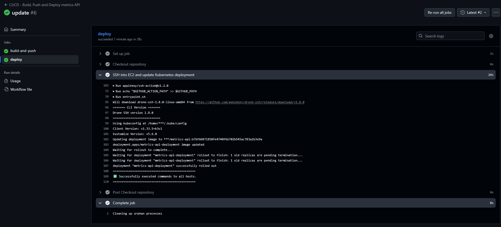

Thus, the full pipeline — from code to production update — has become fully automated, deterministic and aligned with modern CI/CD best practices in Kubernetes environments.

The full pipeline code in GitHub Actions can be accessed [here](https://github.com/CassivsGabriellis/metrics-api-k8s-cluster-performance/blob/main/.github/workflows/ci-cd.yaml).

### Tests performed inside the EC2 instance after deploy

#### Overview of the node, resources in the API namespace and pod listing

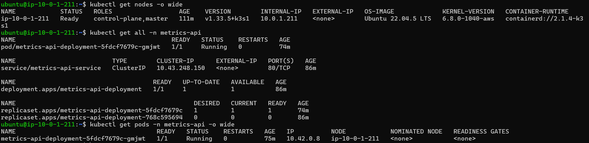

#### Testing the API endpoints via `curl` inside the EC2 instance

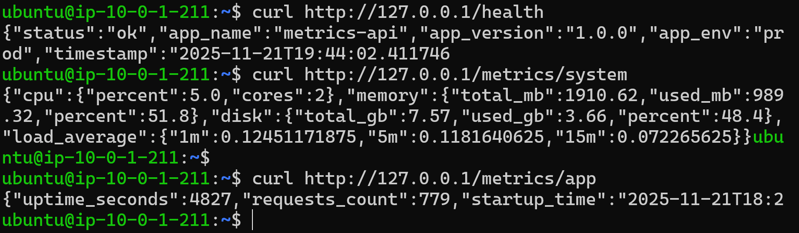

#### Accessing the FastAPI `docs` section via the EC2 instance public IP

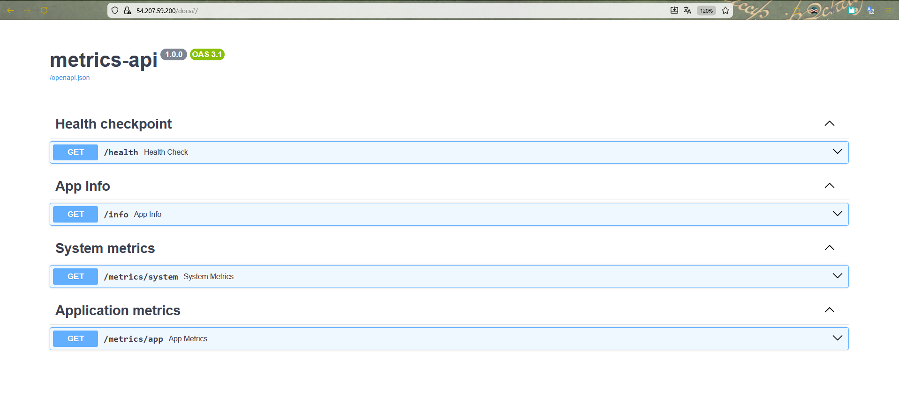

---

## Summary: Accessing the API on EC2 and practical use of the instance

With provisioning complete, the EC2 instance ceases to be just an “infrastructure node” and starts acting as a stable entry point for the metrics API. Below, I describe how it is exposed, how it can be consumed externally, and how it can serve as a basis for future extensions of the project.

### Instance characteristics and public endpoint

The EC2 instance was provisioned as a single Kubernetes node with k3s, using the `t3.small` type, which provides 2 vCPUs and 2 GiB of RAM — a better balance between cost and capacity to run the cluster, the Ingress Controller and the application simultaneously.

From a network perspective, the instance is in:

* A dedicated VPC (`10.0.0.0/16`), with:

  * Public subnet (`10.0.1.0/24`) for the k3s node;
  * Internet Gateway associated with the VPC;
  * Public route table with `0.0.0.0/0` egress to the IGW;
* A specific Security Group for the k3s node, allowing:

  * SSH (port 22) only from the CIDR defined in `allowed_ssh_cidr`;
  * HTTP (port 80) open to `0.0.0.0/0` for public access to the API;
  * HTTPS (port 443) open for future TLS scenarios.

In addition, the instance uses an **Elastic IP**, provisioned via Terraform and exposed through the `ec2_public_ip` output. This ensures that:

* The instance’s public IPv4 remains stable across reboots;
* The CI/CD pipeline and any external clients can point to a fixed address, without needing to update settings on every stop/start.

In practice, this Elastic IP works as the “raw public endpoint” of the API.

### API exposure via NGINX Ingress

Internally, HTTP traffic is routed by the **NGINX Ingress Controller**, installed in the k3s cluster. The logical topology is as follows:

```
Cliente → Elastic IP (port 80) → EC2 (Security Group) 
        → ingress-nginx Service LoadBalancer
        → Ingress (rules / path /) 
        → Service ClusterIP (metrics-api-service) 
        → API pod (container FastAPI on the port 8000)
```

The `Ingress` resource configured for the `metrics-api` namespace routes `/` to `metrics-api-service`, which in turn forwards requests to the `metrics-api-deployment` Deployment. This means that, externally, the API can be consumed directly using the Elastic IP on port 80:

```bash
curl http://<elastic-ip>/health
```

This `/health` endpoint is exposed by the FastAPI application and works as a simple availability check for the service. In this way, any HTTP client — from monitoring scripts to observability tools — can use this address for basic validations or integrations with health probes.

### Using the instance for inspection, debugging and operations

Beyond serving the API externally, the instance is also the central point for administrative and troubleshooting operations. From an SSH session using the private key (`EC2_SSH_KEY`) and the configured user (`EC2_SSH_USER`, in this case `ubuntu`), it is possible to:

* Inspect the state of the cluster:

  ```bash
  kubectl get nodes -o wide
  kubectl get all -n metrics-api
  ```

* Monitor the behavior of the application pods:

  ```bash
  kubectl get pods -n metrics-api -o wide
  kubectl logs -n metrics-api <nome-do-pod>
  ```

* Test the API from inside the cluster, either via port-forward or by running commands inside the pod:

  ```bash
  # Port-forward of the Service to the local machine (inside EC2)
  kubectl port-forward svc/metrics-api-service -n metrics-api 8000:80
  curl http://127.0.0.1:8000/health

  # Direct call from inside the pod
  kubectl exec -it -n metrics-api <pod-name> -- curl -s http://127.0.0.1:8000/health
  ```

This turns the instance into a single observation point for the application’s lifecycle: from the Kubernetes level (Deployments, Pods, Services, Ingress) to the application level (logs, HTTP responses, health status).

### Future extensions: observability, TLS and custom domains

The way the instance was designed allows a series of natural evolutions, without the need to restructure the base:

* **Integration with Prometheus and Grafana:**
  The current k3s cluster can receive an observability stack (such as kube-prometheus-stack or Prometheus Operator) to collect metrics from both infrastructure and the API. The Ingress Controller already provides an HTTP entry point that can be reused to expose dashboards or metrics endpoints.

* **TLS and custom domain (HTTPS):**
  Since the API is already exposed via an Elastic IP, it is simple to create a DNS record in a custom domain (via Route 53 or another provider) pointing to that IP. Then, you can add a new Ingress with a defined host (for example, `api.metrics.mydomain.com`) and integrate a certificate issuer (such as AWS Certificate Manager or Let’s Encrypt) to serve HTTPS traffic.

* **Cluster expansion and new services:**
  The current instance can be the starting point for hosting other microservices related to metrics, dashboards or auxiliary APIs. New namespaces, Deployments and Services can be added to the cluster, all exposed via NGINX Ingress Controller with specific route and host rules.

In summary, the EC2 instance — combined with k3s, NGINX Ingress, Docker and the CI/CD pipeline in GitHub Actions — now operates as a complete application environment, capable not only of serving the metrics API in production, but also of supporting tests, experiments, and future extensions in terms of observability, security (TLS) and logical scalability of the solution.
